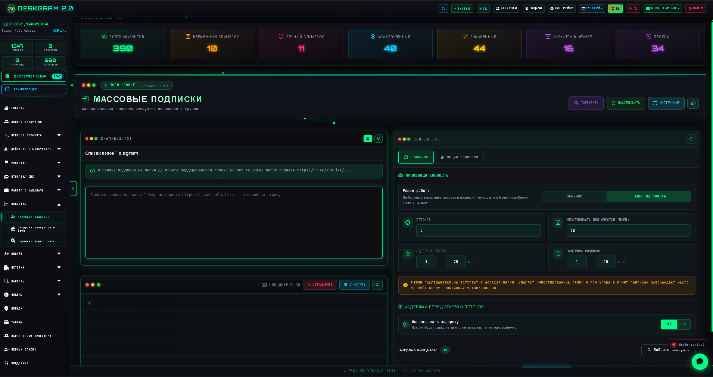
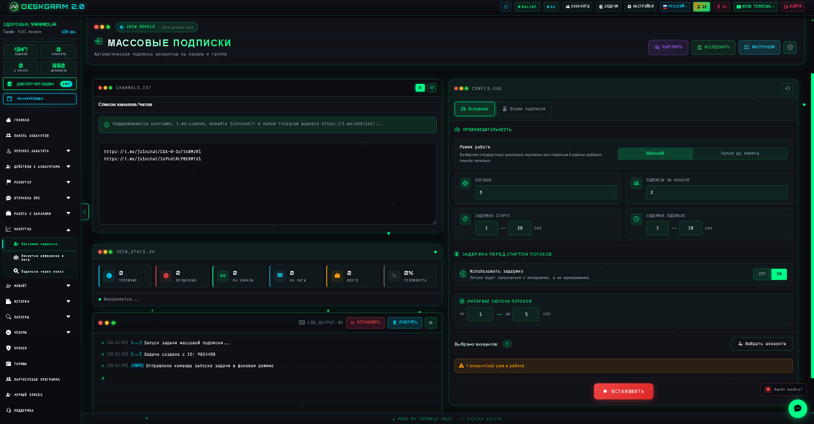
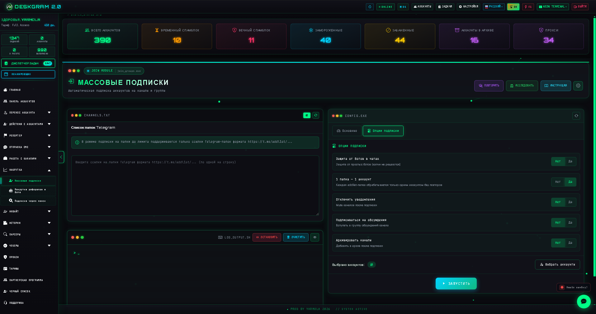
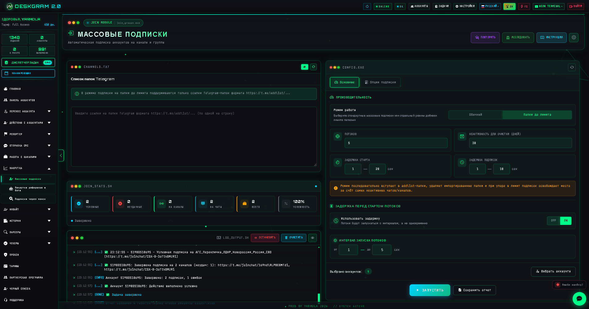

# Массовые подписки в Telegram через Deskgram 2

Массовые подписки в Deskgram 2 помогают распределенно подключать Telegram-аккаунты к каналам, чатам и папкам. Этот модуль полезен для подготовки аккаунтов к дальнейшим сценариям работы, расширения присутствия в нужных сообществах и аккуратной инфраструктурной сборки рабочей сетки.

[Главный хаб Deskgram 2](https://github.com/Deskgram-2/deskgram-2-telegram-automation) · [Сайт](https://deskgram2.com/) · [Telegram-бот](https://t.me/DG2welcomebot) · [Web preview](https://deskgram2.com/web-preview)

## Скриншоты

## Кратко о модуле

| Параметр | Что внутри |
|---|---|
| Основная задача | Массовая подписка на Telegram-каналы, чаты и папки |
| Важные блоки | Список ссылок, статистика, логи, режимы подписки, ограничения |
| Полезен для | Подготовки аккаунтов, инфраструктурной сборки, масштабирования работы |
| Связанные модули | Панель аккаунтов, Прокси, Инвайт |

## Что умеет модуль

- подписывать аккаунты на публичные каналы и чаты;
- работать с инвайт-ссылками и папками Telegram;
- распределять ссылки между аккаунтами без лишних повторов;
- показывать статистику успехов, ошибок и прогресс по задаче;
- задавать задержки, потоки и ограничения для более аккуратной работы.

## Быстрый старт

1. Подготовьте список ссылок на каналы, чаты или папки.
2. Настройте режим подписки и ограничения на аккаунт.
3. Выберите аккаунты и, при необходимости, прокси.
4. Запустите задачу и следите за статистикой.
5. Используйте подготовленные аккаунты в дальнейших модулях.

## С чем лучше сочетать

- [Панель аккаунтов](https://github.com/Deskgram-2/telegram-account-manager-deskgram), если сетка аккаунтов еще не подготовлена.
- [Прокси](https://github.com/Deskgram-2/telegram-proxy-manager-deskgram), если подписки идут через рабочий пул прокси.
- [Сбор аудитории](https://github.com/Deskgram-2/telegram-audience-parser-deskgram), если после подписок нужно собирать пользователей в сообществах.
- [Рассылка в ЛС](https://github.com/Deskgram-2/telegram-direct-messaging-deskgram), если подписки служат подготовкой к дальнейшему контакту.
- [Инвайт](https://github.com/Deskgram-2/telegram-invite-tool-deskgram), если после сборки окружения нужен рост через приглашения.

## Какие соседние цепочки особенно полезны

- [Прогрев аккаунтов](https://github.com/Deskgram-2/telegram-account-warmup-deskgram), если подписки идут как часть аккуратной подготовки сетки;
- [Нейрокомментинг](https://github.com/Deskgram-2/telegram-neuro-commenting-deskgram), если после входа в сообщества запускается AI-активность;
- [Сбор аудитории из комментариев](https://github.com/Deskgram-2/telegram-comment-audience-parser-deskgram), если среда нужна для поиска более теплой базы;
- [Сбор писавших в чатах](https://github.com/Deskgram-2/telegram-active-chat-users-parser-deskgram), если фокус на живых обсуждениях;
- [Диспетчер задач](https://github.com/Deskgram-2/telegram-task-manager-deskgram), если нужно отслеживать подготовку среды и дальнейшие сценарии как один поток.

## Как устроен сценарий

### Список источников

В начале задается база ссылок: обычные публичные адреса, инвайт-ссылки или папки Telegram. От качества и структуры этого списка зависит стабильность всей задачи.

### Режим распределения

Deskgram 2 может работать как по индивидуальным спискам на аккаунт, так и по общей схеме распределения, где ссылки раздаются по аккаунтам без дублей.

### Ограничения и контроль

Задержки, лимиты и статистика помогают не перегружать аккаунты и видеть, как именно движется задача в реальном времени.

## Когда особенно полезен

- когда нужно подготовить аккаунты к инвайту, комментингу или прогреву;
- когда требуется быстро подключить много аккаунтов к нужным сообществам;
- когда важно централизованно управлять подписками, а не делать это вручную;
- когда вы строите инфраструктуру под дальнейшие модули Deskgram 2.

## Почему это удобнее ручной подписки

| Ручной подход | Массовые подписки в Deskgram 2 |
|---|---|
| Медленно масштабируется | Работает по сетке аккаунтов |
| Сложно контролировать лимиты | Есть задержки, потоки и статистика |
| Высокий риск хаоса в списках | Ссылки обрабатываются централизованно |
| Сложнее готовить аккаунты к следующим шагам | Получается инфраструктурный слой под другие модули |

## Сценарии применения

### Сценарий 1. Подготовка среды под дальнейшую активность

Массовые подписки часто используются не как самостоятельная цель, а как инфраструктурный шаг перед комментингом, сбором аудитории и другими execution-модулями.

### Сценарий 2. Мягкий рост присутствия в нише

Если нужно аккуратно нарастить присутствие аккаунтов в нужных сообществах, join groups работает как подготовительный слой без резкого перехода сразу к invite или direct messaging.

### Сценарий 3. Прогрев перед более активными сценариями

В связке с [прогревом аккаунтов](https://github.com/Deskgram-2/telegram-account-warmup-deskgram) этот модуль помогает перевести аккаунты из нейтрального состояния в более рабочую среду, где уже проще запускать следующие действия.

## Что выбрать: массовые подписки или инвайт

| Если задача такая | Лучше использовать |
|---|---|
| Нужно подключить свои аккаунты к нужным сообществам | [Массовые подписки](https://github.com/Deskgram-2/telegram-join-groups-deskgram) |
| Нужно добавлять в группы или каналы внешних пользователей | [Инвайт](https://github.com/Deskgram-2/telegram-invite-tool-deskgram) |
| Нужно сначала подготовить аккаунты, а потом запускать рост | Подписки -> прогрев/комментинг/инвайт |
| Нужна инфраструктурная база под следующие модули | Массовые подписки как подготовительный слой |

## Смежные репозитории

- [Главный хаб Deskgram 2](https://github.com/Deskgram-2/deskgram-2-telegram-automation)
- [Панель аккаунтов](https://github.com/Deskgram-2/telegram-account-manager-deskgram)
- [Прокси](https://github.com/Deskgram-2/telegram-proxy-manager-deskgram)
- [Инвайт](https://github.com/Deskgram-2/telegram-invite-tool-deskgram)
- [Сбор аудитории](https://github.com/Deskgram-2/telegram-audience-parser-deskgram)
- [Рассылка в ЛС](https://github.com/Deskgram-2/telegram-direct-messaging-deskgram)
- [Прогрев аккаунтов](https://github.com/Deskgram-2/telegram-account-warmup-deskgram)
- [Нейрокомментинг](https://github.com/Deskgram-2/telegram-neuro-commenting-deskgram)
- [Диспетчер задач](https://github.com/Deskgram-2/telegram-task-manager-deskgram)

## FAQ

### Этот модуль подходит только для публичных ссылок?

Нет. Он умеет работать не только с обычными адресами, но и с инвайт-ссылками и папками Telegram.

### Можно ли использовать это как подготовительный шаг?

Да. Это один из самых логичных инфраструктурных модулей перед инвайтом, прогревом и другими сценариями.
